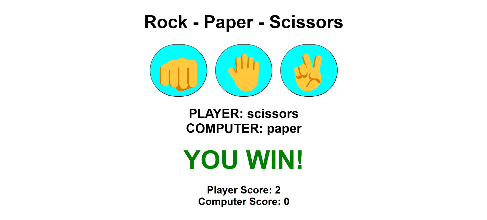

# 🪨📄✂️ Rock Paper Scissors Game

A simple and fun **Rock Paper Scissors** game built with **HTML**, **CSS**, and **JavaScript**. Challenge the computer and see if you can outsmart it!

## 🚀 Demo

[Click here to play the game!](https://ggsrockpaperscissors.netlify.app/)  

## 🎮 Features

- Interactive UI with responsive design
- Real-time score tracking
- Randomized computer choices
- Smooth animations and clean layout
- Lightweight and fast – no external libraries used

## 🛠️ Technologies Used

- **HTML5** – Structure and layout
- **CSS3** – Styling and animations
- **JavaScript (ES6)** – Game logic and interactivity

## 📦 How to Run Locally

1. Clone the repository:

   ```bash
   git clone https://github.com/CodeCourtAce/RockPaperScissors.git


